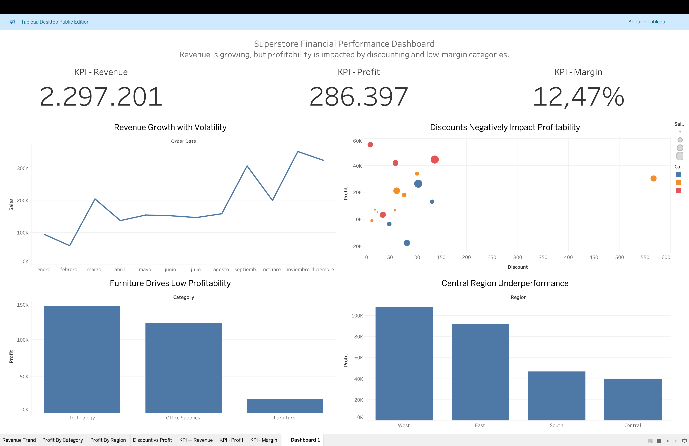

# 📊 From Data to Decisions: A CFO Case Study

## 🎯 Objective

This project simulates the role of a Chief Financial Officer (CFO) by analyzing retail sales data to extract actionable insights and support strategic decision-making.

---

## 📦 Dataset

* Source: Superstore dataset
* Content: Sales transactions including revenue, profit, discounts, customers, and regions

---

## ⚙️ Process

### 1. Data Preparation (Python)

* Data cleaning and column selection
* Date formatting and time features (YearMonth)
* Creation of key metrics:

  * Profit Margin = Profit / Sales

### 2. Analysis

* KPI analysis (Revenue, Profit, Margin)
* Profitability by category and region
* Discount impact on profitability
* Time series analysis (monthly revenue trend)

### 3. Visualization (Tableau)

* Interactive dashboard to communicate insights
* Focus on business storytelling and decision-making

---

## 📊 Dashboard



---

## 🔍 Key Insights

* 📈 Revenue shows an upward trend but with high volatility
* ⚠️ Profitability is impacted by excessive discounting
* 🪑 Furniture category has very low margins (~2%)
* 🌍 Central region underperforms compared to others
* 💡 Revenue ≠ Profit → growth is not always efficient

---

## 🧠 Strategic Recommendations

* Reduce exposure to low-margin products (Furniture)
* Implement discount control policies
* Focus on high-profit customers and segments
* Optimize underperforming regions (Central)
* Improve forecasting to manage volatility

---

## 🛠️ Tools Used

* Python (Pandas, Matplotlib)
* Tableau Public
* Jupyter Notebook

---

## 🚀 Project Value

This project demonstrates:

* End-to-end data analysis workflow
* Business-oriented thinking
* Ability to translate data into strategic decisions
* Data visualization and storytelling skills

---

## 📁 Project Structure

```
/data
    Sample - Superstore.csv
    superstore_clean.csv

/notebooks
    analysis.ipynb

/tableau
    superstore_dashboard.twbx

/images
    dashboard.png

README.md
```

---

## 📌 Final Note

The company shows strong revenue growth but suffers from structural profitability issues.
Addressing discount policies and low-margin segments is key to sustainable performance.
